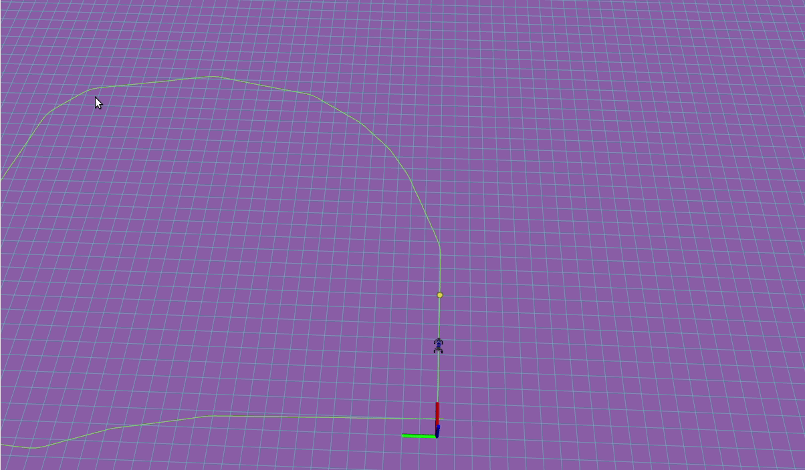

# pure_pursuit
ROS1 impleemntation of pure pursuit controller

For ROS2 check this branch. [foxy-devel](https://github.com/HemaZ/pure_pursuit/tree/foxy-devel)

- [pure_pursuit](#pure_pursuit)
  - [How to run](#how-to-run)
  - [Subscribes to](#subscribes-to)
  - [Publishes to](#publishes-to)
  - [Node's parameters](#nodes-parameters)

## How to run
`rosrun pure_pursuit pure_pursuit_node`

## Subscribes to
This node requires TF from map -> odom -> base_link
| Topic name         | Type              | Description                                                            |
| ------------------ | ----------------- | ---------------------------------------------------------------------- |
| /pure_pursuit/path | nav_msgs/Path     | Target path to follow                                                  |
| /odom              | nav_msgs/Odometry | To update the lookahead distance depending on the car speed (optional) |

## Publishes to

| Topic name                    | Type                                 | Description                                             |
| ----------------------------- | ------------------------------------ | ------------------------------------------------------- |
| /pure_pursuit/control         | ackermann_msgs/AckermannDriveStamped | Ackermann message contains the steering angle and speed |
| /pure_pursuit/lookahead_point | geometry_msgs/PointStamped           | Target Lookahead point                                  |

## Node's parameters

| Parameter name  | Type   | Description                                                                                |
| --------------- | ------ | ------------------------------------------------------------------------------------------ |
| ld_gain         | Double | lookahead distance gain to depend the lookahead distance on speed ld = ld_gain * car_speed |
| min_ld          | Double | Minimum lookahead distance                                                                 |
| car_wheel_base  | Double | The distance between the car's front and back wheels                                       |
| controller_freq | Int    | The controller Frequency                                                                   |
| map_frame       | String | map frame name                                                                             |
| base_frame      | String | base link frame name                                                                       |
